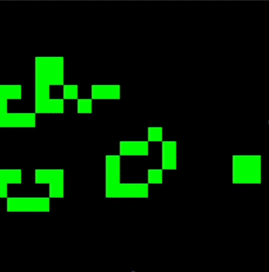
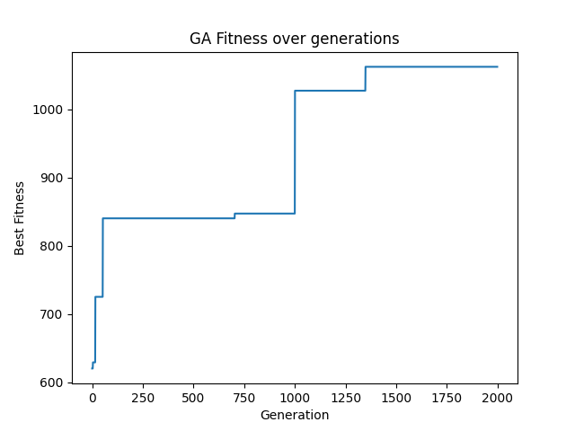

# Conway's Game of Life: AI Pattern Optimization Engine (Genetic Algorithm)

## Project Overview

This project implements a fascinating intersection of cellular automata and artificial intelligence: a Genetic Algorithm (GA) designed to evolve stable and long-lived patterns for Conway's Game of Life. The application simulates the Game of Life, uses a GA to search for optimal initial patterns, visualizes the GA's progress, and allows for the simulation of the evolved patterns. The entire application is containerized using Docker for consistent and reproducible execution across different environments.

## Demo

<p align="center">
  
</p>

## Fitness Plot 

This graph illustrates the Genetic Algorithm's evolutionary progress over **2000 generations**. With a population size of **300** and a mutation rate of **0.03**, the "Best Fitness" steadily increased in distinct steps, reflecting the GA's ability to discover fitter patterns. The fitness ultimately plateaued around **1063**, indicating the best pattern found survived for over half of the maximum possible **2000 simulation steps**.

<p align="center">
    
    <br>
    <i>Best fitness score over 2000 generations</i>
</p>


---
 
## Core Features

- **Conway's Game of Life Simulation**: A NumPy-based implementation of the Game of Life rules, capable of simulating board states over generations.
- **Genetic Algorithm (GA) Core**:
  - **Population Management**: Initializes and manages a population of Game of Life patterns.
  - **Selection**: Employs tournament selection to choose fitter parents.
  - **Crossover (Uniform)**: Combines genetic material from parents to create diverse offspring.
  - **Mutation**: Introduces random changes to offspring, crucial for exploration and escaping local optima.
  - **Enhanced Fitness Function**: Accurately assesses pattern longevity by detecting not only death but also Period-N oscillations (including still lifes, blinkers, and higher-period cycles).
  - **Elitism**: The best individual from each generation is preserved, ensuring the best fitness never decreases.
- **GA Performance Visualization**: Uses Matplotlib to plot "Best Fitness over Generations."
- **Evolved Pattern Visualization**: Utilizes Pygame to display the final evolved pattern dynamically.
- **Data Export & Persistence**: Saves results as `.txt`, `.npy`, and `.csv` in a host-mapped Docker volume.
- **Docker Containerization**: Ensures a consistent and isolated runtime environment.

## Genetic Algorithm Objective & Parameters

The GA's primary objective is to find initial Game of Life patterns that survive the longest without dying out or prematurely entering a repeating oscillation cycle.

Key parameters (defined in `ga_parameters.py`):

- `ga_population_size`
- `ga_num_generations`
- `ga_mutation_rate`
- `ga_simulation_steps`
- `ga_board_width`, `ga_board_height`
- `ga_fitness_threshold`
- `ga_crossover_rate`
- `ga_tournament_size`

To modify these, edit `ga_parameters.py` and rebuild the Docker image.

## Installation & Setup (Docker-Focused)

### Prerequisites

- Docker Desktop (Windows/macOS) or Docker Engine (Linux)
- Git installed

### Steps

1. **Clone the Repository**:
   ```bash
   git clone <your_repository_url>
   cd Conway-s-Game-of-Life
   ```

2. **Create Host Results Directory**:
   ```bash
   mkdir ga_results_host
   ```

3. **Build Docker Image**:
   ```bash
   docker build --no-cache -t game-of-life-ga .
   ```

## Usage

### Run the Docker Container (With Data Persistence)

For macOS/Linux:
```bash
docker run -it --rm -v $(pwd)/ga_results_host:/app/ga_results game-of-life-ga
```

For Windows (PowerShell):
```powershell
docker run -it --rm -v ${PWD}/ga_results_host:/app/ga_results game-of-life-ga
```

### Understanding the Output

- **Console Output**: See generation progress and best fitness updates.
- **Saved Files** (in `ga_results_host`):
  - `evolved_pattern_YYYYMMDD-HHMMSS.txt`
  - `evolved_pattern_YYYYMMDD-HHMMSS.npy`
  - `fitness_history_YYYYMMDD-HHMMSS.csv`


---


##  Author

Built by Leslie Osei-Anane as a Genetic Algorithm project.
