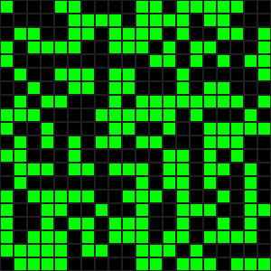

# Conway's Game of Life: AI Pattern Optimization Engine (Genetic Algorithm)

[](https://www.python.org/)
[](https://www.docker.com/)
[](https://opensource.org/licenses/MIT)
[](https://numpy.org/)
[](https://matplotlib.org/)

## Table of Contents

- [Project Overview](#project-overview)
- [Demo](#demo)
- [Fitness Plot](#fitness-plot)
- [Core Features](#core-features)
- [Genetic Algorithm Objective & Parameters](#genetic-algorithm-objective--parameters)
- [Installation & Setup](#installation--setup-docker-focused)
- [Usage](#usage)
- [Output Interpretation](#output-interpretation)
- [Author](#author)

## Project Overview

This project implements a sophisticated intersection of **cellular automata** and **artificial intelligence**: a Genetic Algorithm (GA) designed to evolve stable and long-lived patterns for Conway's Game of Life. 

**What it does:**
- Uses evolutionary computation to discover patterns that survive as long as possible in Conway's Game of Life
- Employs advanced fitness evaluation that detects not just death, but also premature oscillations and stagnation
- Provides comprehensive visualization of both the evolutionary process and the resulting patterns
- Containerized with Docker for consistent execution across different environments

**Why it matters:**
Conway's Game of Life, despite its simple rules, exhibits complex emergent behavior. Finding patterns that survive for extended periods is computationally challenging and provides insights into pattern formation, stability, and evolution in complex systems.

## Demo

<p align="center">
  
</p>

## Fitness Plot

This graph illustrates the Genetic Algorithm's evolutionary progress over **2000 generations**. With a population size of **300** and a mutation rate of **0.03**, the "Best Fitness" steadily increased in distinct steps, reflecting the GA's ability to discover fitter patterns. The fitness ultimately plateaued around **1063**, indicating the best pattern found survived for over half of the maximum possible **2000 simulation steps**.

<p align="center">
    
    <br>
    <i>Best fitness score over 2000 generations</i>
</p>

---
 
## Core Features

### Game of Life Engine
- **High-Performance Simulation**: NumPy-based implementation optimized for speed and memory efficiency
- **Configurable Board Size**: Customizable grid dimensions (default: 20x20)
- **Accurate Rule Implementation**: Faithful reproduction of Conway's original rules

### Genetic Algorithm Components
- **Population Management**: Initializes and evolves populations of Game of Life patterns
- **Tournament Selection**: Selects fitter parents through competitive selection process
- **Uniform Crossover**: Combines genetic material from parents with configurable crossover rate
- **Adaptive Mutation**: Introduces random changes to maintain genetic diversity
- **Enhanced Fitness Evaluation**: 
  - Detects pattern death (all cells become inactive)
  - Identifies oscillation cycles (patterns that repeat)
  - Rewards longevity while penalizing early stagnation
- **Elitism Strategy**: Preserves the best individual from each generation

### Visualization & Analysis
- **Real-time Progress Tracking**: Live console output showing generation progress
- **Fitness Plotting**: Matplotlib-generated graphs showing evolutionary progress
- **Pattern Visualization**: Pygame-based display of evolved patterns in action
- **Comprehensive Data Export**: Multiple file formats for further analysis

### Infrastructure
- **Docker Containerization**: Ensures consistent runtime environment across platforms
- **Data Persistence**: Host-mapped volumes for result preservation
- **Flexible Configuration**: Easy parameter tuning through configuration files

## Genetic Algorithm Objective & Parameters

### Primary Objective
The GA seeks to discover initial Game of Life patterns that **maximize survival time** while avoiding:
- **Early Death**: Patterns that quickly die out completely
- **Premature Oscillation**: Patterns that enter short cycles too early
- **Stagnation**: Patterns that become static (still lifes) without sufficient evolution

### Configuration Parameters

All parameters are defined in `ga_parameters.py` and can be modified before building the Docker image:

| Parameter | Default Value | Description | Impact |
|-----------|---------------|-------------|---------|
| `ga_population_size` | 200 | Number of patterns in each generation | Larger = more diversity, slower execution |
| `ga_num_generations` | 10 | Maximum generations to evolve | More = better solutions, longer runtime |
| `ga_mutation_rate` | 0.03 | Probability of cell mutation (3%) | Higher = more exploration, less stability |
| `ga_simulation_steps` | 2000 | Max steps to evaluate each pattern | Longer = finds truly stable patterns |
| `ga_board_width` | 20 | Grid width in cells | Larger = more complex patterns possible |
| `ga_board_height` | 20 | Grid height in cells | Larger = more complex patterns possible |
| `ga_fitness_threshold` | 2001 | Stop if fitness reaches this value | Early stopping for perfect solutions |
| `ga_crossover_rate` | 0.8 | Probability of crossover (80%) | Higher = more genetic mixing |
| `ga_tournament_size` | 5 | Number of candidates in selection | Larger = stronger selection pressure |

### Example Configurations

**Quick Testing** (faster execution):
```python
ga_population_size = 50
ga_num_generations = 100
ga_simulation_steps = 500
```

**Deep Search** (better results):
```python
ga_population_size = 500
ga_num_generations = 2000
ga_simulation_steps = 5000
```

**High Mutation Exploration**:
```python
ga_mutation_rate = 0.1  # 10% mutation rate
ga_crossover_rate = 0.6  # Lower crossover for more mutation impact
```

### Parameter Tuning Tips
- **Start Small**: Use smaller values for initial testing and parameter exploration
- **Balance Trade-offs**: Population size vs. generation count vs. simulation steps
- **Monitor Results**: Watch fitness plots to understand if parameters need adjustment
- **Computational Cost**: Remember that total evaluations = population_size × num_generations × simulation_steps

## Installation & Setup (Docker-Focused)

### Prerequisites

- **Docker Desktop** (Windows/macOS) or **Docker Engine** (Linux)
- **Git** installed
- **8GB+ RAM** recommended for larger populations
- **2GB+ disk space** for Docker image and results

### Quick Start

1. **Clone the Repository**:
   ```bash
   git clone https://github.com/lesprgm/Conways-Life-AI-Engine.git
   cd Conways-Life-AI-Engine
   ```

2. **Create Host Results Directory**:
   ```bash
   mkdir ga_results_host
   ```

3. **Build Docker Image**:
   ```bash
   docker build --no-cache -t game-of-life-ga .
   ```

### Alternative: Local Python Setup

If you prefer running without Docker:

1. **Install Python Dependencies**:
   ```bash
   pip install -r requirements.txt
   ```

2. **Create Results Directory**:
   ```bash
   mkdir ga_results
   ```

3. **Run Directly**:
   ```bash
   python main.py
   ```

## Usage

### Running with Docker (Recommended)

#### Standard Execution
For macOS/Linux:
```bash
docker run -it --rm -v $(pwd)/ga_results_host:/app/ga_results game-of-life-ga
```

For Windows (PowerShell):
```powershell
docker run -it --rm -v ${PWD}/ga_results_host:/app/ga_results game-of-life-ga
```

For Windows (Command Prompt):
```cmd
docker run -it --rm -v %cd%/ga_results_host:/app/ga_results game-of-life-ga
```

#### Background Execution
To run in the background and save logs:
```bash
docker run -d --name gol-ga -v $(pwd)/ga_results_host:/app/ga_results game-of-life-ga > evolution.log 2>&1
```

Check progress:
```bash
docker logs -f gol-ga
```

#### Interactive Mode
For development or debugging:
```bash
docker run -it --rm -v $(pwd)/ga_results_host:/app/ga_results --entrypoint /bin/bash game-of-life-ga
```

### Running Locally

If you installed dependencies locally:
```bash
python main.py
```

### Expected Runtime

Execution time varies significantly based on parameters:

| Configuration | Population | Generations | Approx. Time |
|---------------|------------|-------------|--------------|
| Quick Test | 50 | 100 | 5-10 minutes |
| Standard | 200 | 1000 | 1-2 hours |
| Deep Search | 500 | 2000 | 10-16 hours |

## Output Interpretation

### Console Output
- **Generation Progress**: Shows current generation number and total
- **Fitness Updates**: Reports when a better pattern is discovered
- **Final Summary**: Best fitness achieved and total generations completed

### Generated Files

The application creates three types of output files in `ga_results_host/`:

#### 1. Pattern Files (`.txt`)
**Format**: `evolved_pattern_YYYYMMDD-HHMMSS.txt`
```
1 0 1 0 0 0 0 0 1 1 0 0 0 0 1 0 0 0 0 0
0 1 0 1 0 1 1 0 0 0 1 1 1 0 0 0 1 1 0 0
1 1 0 0 0 0 1 0 0 0 0 0 1 1 1 1 1 1 1 1
```
- **Content**: The best evolved pattern as a space-separated grid
- **Usage**: Can be loaded and visualized in other Game of Life simulators
- **Format**: 1 = alive cell, 0 = dead cell

#### 2. NumPy Arrays (`.npy`)
**Format**: `evolved_pattern_YYYYMMDD-HHMMSS.npy`
- **Content**: Binary format of the pattern for Python analysis
- **Usage**: Load with `numpy.load()` for programmatic analysis
- **Advantage**: Preserves exact data types and array structure

#### 3. Fitness History (`.csv`)
**Format**: `fitness_history_YYYYMMDD-HHMMSS.csv`
```
Generation,Fitness
1,23
2,23
3,45
4,45
5,67
```
- **Content**: Best fitness score for each generation
- **Usage**: Create custom plots, analyze convergence patterns
- **Applications**: Parameter tuning, performance analysis

### Interpreting Fitness Scores

| Fitness Range | Interpretation | Pattern Behavior |
|---------------|----------------|-------------------|
| 0-50 | Poor survival | Dies quickly or becomes static early |
| 51-200 | Moderate success | Short-lived activity before stabilizing |
| 201-500 | Good patterns | Sustained activity with eventual cycles |
| 501-1000 | Excellent patterns | Long-lived with complex evolution |
| 1000+ | Outstanding | Near-maximum survival or gliders |

**Note**: Maximum possible fitness equals `ga_simulation_steps` (default: 2000)

### Visual Analysis

After evolution completes, the application displays:
1. **Fitness Plot**: Shows evolutionary progress over generations
2. **Pattern Animation**: Live visualization of the best evolved pattern
3. **Final State**: The pattern's behavior after evolution


---

## Author

**Leslie Osei-Anane** - *Initial work and development*

This project was created as an exploration of genetic algorithms applied to cellular automata, specifically Conway's Game of Life. It demonstrates the power of evolutionary computation in discovering complex, emergent patterns from simple rules.

### Connect
- GitHub: [@lesprgm](https://github.com/lesprgm)
- Project Link: [Conway's Life AI Engine](https://github.com/lesprgm/Conways-Life-AI-Engine)

### License
This project is licensed under the MIT License - see the [LICENSE](LICENSE) file for details.
